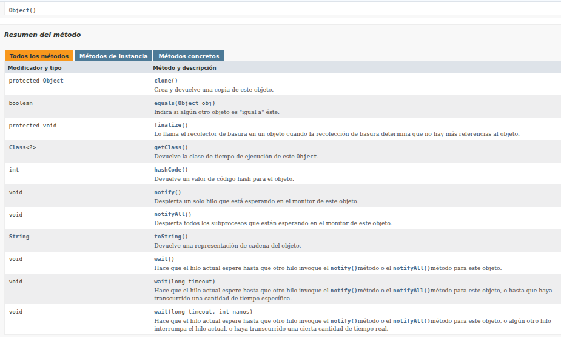

# Clase Object

La clase Objectes la raíz de la jerarquía de clases. Cada clase tiene Objectuna superclase. Todos los objetos, incluidas las matrices, implementan los métodos de esta clase.

Por lo tanto todo objetos que herede de ella como la Clase String heredara tdos sus metodos

### Java es orientado a objetos ?
Java no es considerado un lenguaje 100% orientado a objetos porque incorpora elementos que no son objetos. Los principales motivos son:

- Tipos primitivos:
Java tiene tipos de datos primitivos (como int, char, double, boolean, etc.) que no son objetos. Estos tipos se usan para optimizar el rendimiento y el consumo de memoria, pero, al no ser objetos, no pueden invocar métodos ni ser manipulados de la misma manera que las instancias de clases.

- Miembros estáticos:
Los métodos y variables declarados como static pertenecen a la clase y no a una instancia. Esto permite utilizarlos sin necesidad de crear un objeto, lo que se desvía del modelo puramente orientado a objetos.

- Herencia e interfaces:
Aunque todo en Java (excepto los tipos primitivos) es objeto, la existencia de elementos como métodos y campos estáticos implica que no todo sigue la filosofía de la OOP, donde todo debería ser una instancia.

Estos factores permiten que Java sea un lenguaje híbrido que combina características orientadas a objetos con otros enfoques que ayudan a mejorar el rendimiento y la eficiencia. Por ello, aunque Java está fuertemente orientado a objetos, no es 100% orientado a objetos.
## Fuentes
[https://docs.oracle.com/javase/8/docs/api/java/lang/Object.html](https://docs.oracle.com/javase/8/docs/api/java/lang/Object.html)