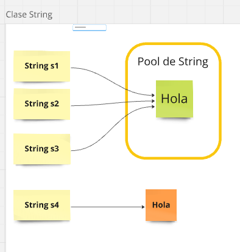
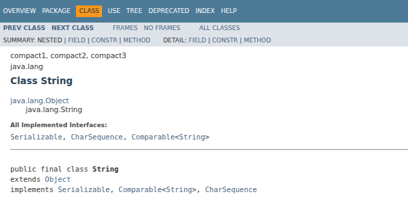
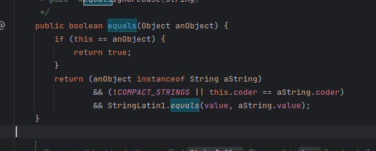
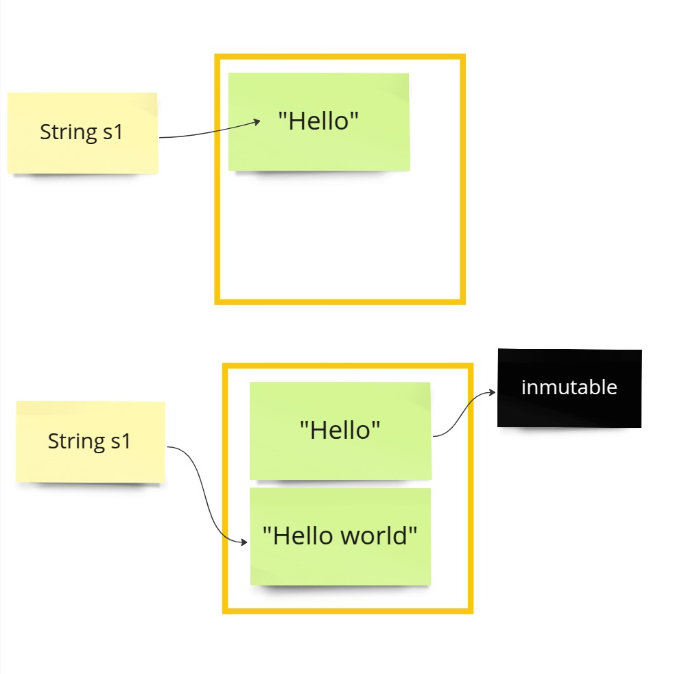
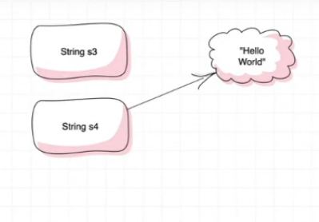

# Clase String

Archivos de referencia --> `src/programacionOrientadaaObjetos/ClaseString`

### Que es el pool de String ?
Muchas veces cuando trabajamos con Java tenemos  que comparar objetos y tipos básicos entre ellos. Si recordamos de otro artículo anterior , para comparar tipos básicos usamos el operador == que es el operador de comparación . Por otro lado si comparamos objetos usamos el método equals(). Hasta aquí todo es perfecto pero existen algunas excepciones que  generan dudas. Vamos a hablar un poco de ellas.

#### Codificando podemos ver que ...
```java
public class Principal {
    public static void main(String[] args) {

        String s1 = "Hola";  //POOL DE STRING
        String s2 = "Hola";
        String s3 = "Hola";


        String s4 = new String("Hola");

        System.out.println(s4);
        System.out.println("s1==s3 :" + s1==s3);
        System.out.println("s1==s4 :" + s1==s4);
    }
}
```

##### cuantos objectos hay ??
- Existen 2 objetos!!! porque los 3 primeros se crean dentro del pool de string,entonces cuando se crea un nuevo objeto en vez de crear un nuevo espacio en el pool crea una nueva variable de referencia s2 o s3 y hace que apunte el objeto dentrio del poll.
- `String s3 = new String("Hola");
- `El otro String se crea fuera del pool,por lo tanto es otro objeto 



Una forma de probar esto seria hacer usando el signo  `==`
```java
System.out.println("s1==s3 :" + s1==s3); //true
System.out.println("s1==s4 :" + s1==s4); //false
```

Ahora si yo comparo 
```java
 System.out.println("S1.equals(s4) : " + (s1.equals(s4))); //return true

```
Aca ocurre que compara el contenido de la variable no el puntero de referencia del objeto


####  Lease articulo sobre la clase [object](ClaseObject.md)

### Conociendo la clase String vs StringBuilder
Como String hereda de Object 

La clase String Redefine`override el metodo Equals y no compara por referencia sino por contenido



### Inmutabilidad de la clase String
La clase String en Java se considera inmutable porque, una vez creado, el contenido de un objeto String no puede modificarse. Cualquier operación que parezca alterar un String, como concatenar o reemplazar caracteres, en realidad crea un nuevo objeto en memoria, dejando intacto el original.

### Razones y beneficios de la inmutabilidad de String:
- Seguridad:
La inmutabilidad evita que se modifiquen valores sensibles (como contraseñas o claves) una vez que han sido asignados.

- Eficiencia en el pool de Strings:
Java utiliza un área de memoria especial llamada String Pool para almacenar literales. Gracias a la inmutabilidad, es seguro compartir instancias de String entre diferentes partes de la aplicación, lo que reduce el consumo de memoria.

- Hilo de ejecución seguro (Thread-Safe):
Los objetos String inmutables pueden ser compartidos entre múltiples hilos sin riesgo de que un hilo modifique el valor que otro hilo está utilizando, evitando condiciones de carrera.

- Optimización de hashCode:
Al no poder cambiar, el valor de hashCode() de un String se puede calcular una sola vez y reutilizarlo en estructuras de datos como HashMap o HashSet, mejorando el rendimiento.

En resumen, la inmutabilidad de la clase String proporciona ventajas en seguridad, eficiencia y manejo de concurrencia, lo que la convierte en un componente clave en el diseño de Java.Fuentes

```java
package programacionOrientadaaObjetos.ClaseString;

public class Inmutable {

    public static void main(String[] args) {
        String s1="Hello";
        s1="hello world";

        System.out.println("inmutable :" +s1); //inmutable :hello world
    }
}

```
#### Por que aca me retorna hello world ?
Pasa lo siguiente decimos que es inmutable , pero el OBJETO es inmutable (es el unico que no podra cambiar)
la referencia al objeto es la que si cambia apuntando a un nuevo objeto , pero el objeto creado jamas se volvera poder a modificar , de echo la clase String esta declarada como  `Final` 


### Mutabilidad de la clase StringBuilder
La clase StringBuilder si es mutable
`https://www.arquitecturajava.com/java-string-pool-un-concepto-importante/`
`https://docs.oracle.com/javase/8/docs/api/java/lang/Object.html`


#### Asignacion de null a variable 

Cuando asignamos null a una variable , se queda sin referencia , eliminamos el puntero que apunta al objeto

```
  String s3 = "Hello World";
  String s4 = s3;
  s3=null;
  System.out.println("s4 es igual a s3 " + s4 + " y la referencia de s3 al ser null queda sin referencia");

```

