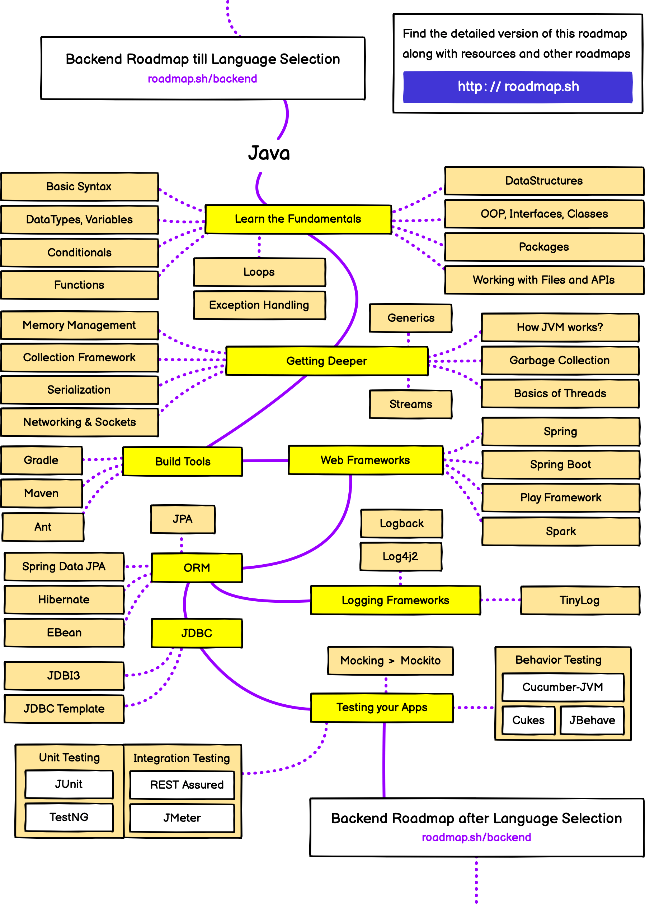

# OCP Oracle Certified Professional Java SE 17 Developer Study Guide
Esta es una guia para la certificacion de Oracle en java SE 17
donde ire de forma cronologica iteractiva e incremental subiendo temas y ejercicios

## Hoja de Ruta o Roadmap 

Estoy usando lapagina web de [roadmap.sh](https://roadmap.sh/)
Donde yo seguire la hoja de ruta orientada de [java](https://roadmap.sh/java)

## Consejos adicionales
#### Práctica Constante: 
Es fundamental escribir código diariamente para afianzar los conceptos aprendidos y desarrollar una lógica de programación sólida. 
#### participacion en comunidades como :
- Únete a foros y comunidades en línea, como [CodeRanch](https://coderanch.com/) o 
- subreddits relacionados con Java.

#### Simulacros de Examen: 
Realiza exámenes de práctica para evaluar tu progreso y acostumbrarte al formato y la presión del examen real.  Esto te ayudará a gestionar mejor el tiempo y a identificar áreas que requieren más estudio.
#### Recursos
- la pagina [Recursos para desarrolladores](https://www.java.com/es/)
- la pagina [www.w3school.com/java](https://www.w3schools.com/java/)
- la pagina [https://coderanch.com/](https://coderanch.com/)
- la pagina [https://www.codewars.com/trainer/setup](https://www.codewars.com/trainer/setup)

## Información sobre el Examen
El examen 1Z0-829 para la certificación Java SE 17 Developer consta de 50 preguntas de opción múltiple, con una duración de 90 minutos. Para aprobar, se requiere una puntuación mínima del 68%. Puedes encontrar más detalles y registrarte para el examen en el sitio oficial de Oracle.

### Seguime en mis perfiles 💥
- GitHub : [https://github.com/arielZarate](https://github.com/arielZarate)
- linkedin : [https://www.linkedin.com/in/ariel-zarate/](https://www.linkedin.com/in/ariel-zarate/)
